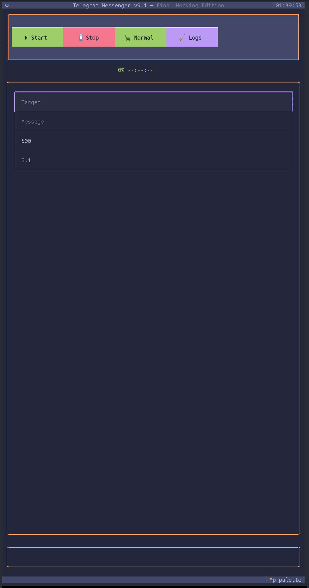

# Phantom-Flood Telegram Spammer

**Textual UI Telegram Message Flooder**

`phantom-flood` is a simple, text-based user interface (TUI) application for sending mass messages on Telegram. It utilizes multiple Telegram accounts to flood target users or groups with messages.  **Use responsibly and ethically. Misuse can lead to account suspensions and potential legal repercussions.**

## Installation

1.  **Clone the repository** (if applicable, if you are setting up a local repo, otherwise just create the files).
2.  **Navigate to the project directory** in your terminal.
3.  **Install dependencies** using pip:

    ```bash
    pip install -r requirements.txt
    ```

    This will install the required Python libraries: `telethon` and `textual`.

## Files Included

*   **`main.py`**: The main Python script containing the application code and Textual UI.
*   **`accounts.txt`**:  This file stores your Telegram account credentials. **You MUST create and populate this file before running the spammer.**
*   **`requirements.txt`**: Lists the Python packages that need to be installed for the application to run.
*   **`sessions/`**:  This directory will be created to store Telegram session files for each account, allowing you to stay logged in across sessions.

## Configuration - `accounts.txt`

You need to configure the `accounts.txt` file with your Telegram API credentials and phone numbers. Each line in the file represents a Telegram account and should follow this format:
content_copy
download
Use code with caution.
Markdown

API_ID,API_HASH,+PHONE_NUMBER

*   **`API_ID`**: Your Telegram API ID.  Get this from [Telegram API development tools](https://my.telegram.org/apps).
*   **`API_HASH`**: Your Telegram API Hash. Get this from [Telegram API development tools](https://my.telegram.org/apps).
*   **`+PHONE_NUMBER`**: Your Telegram account phone number in international format (e.g., `+15551234567`).

**Example `accounts.txt` (replace with your actual API details and phone numbers):**
content_copy
download
Use code with caution.

1234567,your_api_hash_here,+15550001111
7654321,another_api_hash_here,+15550002222

**Important:**

*   Get API credentials from [https://my.telegram.org/apps](https://my.telegram.org/apps). Create a new app if you don't have one already. You can use dummy app name and description.
*   Each phone number you add to `accounts.txt` MUST be a valid Telegram account.

## How to Run

1.  **Ensure `accounts.txt` is correctly configured** with your API credentials and phone numbers.
2.  **Open your terminal** and navigate to the project directory.
3.  **Run the script:**

    ```bash
    python main.py
    ```

    This will start the Telegram Spammer application with the Textual UI.

## Using the Phantom-Flood UI

Once the application starts, you will see the following UI elements:

*   **Header**: Displays the application title and clock.
*   **Control Panel**:
    *   **▶ Start Button**: Initiates the message flood.
    *   **⏹ Stop Button**: Stops the ongoing flood.
    *   **🚀 Turbo Button**: Toggles Turbo mode for faster sending (may trigger flood waits more often). Switches to "🐢 Normal" when activated.
    *   **🧹 Logs Button**: Clears the event log.
*   **Progress Bar**: Shows the overall progress of sent messages against the limit.
*   **Configuration Panel**:
    *   **Target Input**:  Enter the target username, chat link, or phone number (e.g., `@username`, `t.me/joinchat/xxxxx`, `+15551234567`).
    *   **Message Input**: Type the message you want to send.
    *   **Limit Input**: Set the maximum number of messages to send in total (default is 500).
    *   **Delay Input**:  Set the delay in seconds between messages (default is 0.1 seconds). Adjust this to avoid triggering flood waits excessively.
*   **Event Log**: Displays real-time logs of the application's activities, including connection status, authentication, message sending, and errors.
*   **Footer**: Displays the application's subtitle.

**Usage Steps:**

1.  **Start the application:** Run `python main.py`.
2.  **Enter Target:** In the "Target" input field, enter the target Telegram user, group, or channel identifier.
3.  **Enter Message:**  Write your message in the "Message" input.
4.  **Set Limit (Optional):** Change the "Limit" if you want to send more or fewer than the default 500 messages.
5.  **Set Delay (Optional):** Adjust the "Delay" if needed (especially if you encounter flood wait errors, increase the delay).
6.  **Click "▶ Start"**:  Begin the message flood.
7.  **Monitor the "Event Log" and "Progress Bar"** for status updates.
8.  **Click "⏹ Stop"** to manually halt the process.
9.  **Click "🚀 Turbo"** to toggle faster sending mode.
10. **Click "🧹 Logs"** to clear the event log.

**Authentication:**

*   The first time you run the script for each phone number in `accounts.txt`, you will be prompted to enter the Telegram SMS code or call verification code in a dialog box within the UI.
*   If 2FA is enabled on the account, you will be prompted for your 2FA password after entering the verification code.
*   The session will be saved in the `sessions/` directory, so you usually only need to authenticate once per account.

**Rate Limiting and Flood Waits:**

*   Telegram has rate limits to prevent spam. If you send messages too quickly, you might encounter "Flood Wait" errors. The script handles these errors by pausing automatically, but excessive flooding can still lead to temporary or permanent account restrictions.
*   Use the "Delay" input and "Turbo" mode responsibly to manage sending speed.

## Previews

Simple UI.  Potent function.  *Elegance* in devastation.


*UI Main Screen. Primed for Operation.*



*Message Flood Engaged. Witness the cascade.*


**Disclaimer:**

**This tool is provided for educational and testing purposes only. Misusing it to send unsolicited spam or engage in harmful activities is unethical and may violate Telegram's Terms of Service, potentially leading to account suspensions or other consequences. Use at your own risk. The creator is not responsible for any misuse or damage caused by this tool.**
